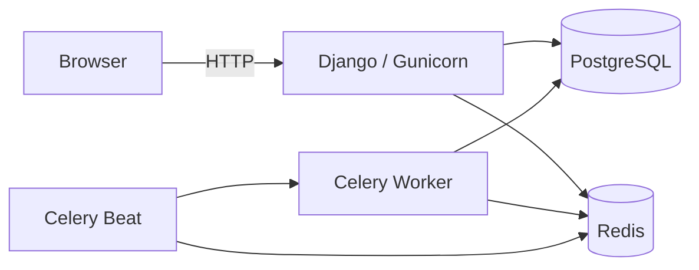

Django web application for managing a service business: clients, masters (staff), procedures (services), and appointments. The UI is a server-rendered admin panel with HTMX-driven modals, list/detail views, and a FullCalendar-based appointment calendar. Phone-number authentication is used for staff access.

## Features

- **Client management** — CRUD with search, pagination, and appointment history on detail pages
- **Master management** — CRUD, calendar color per master, procedure assignment
- **Procedure management** — CRUD with soft delete
- **Appointments** — list view with status/master filters and statistics; calendar view with create/update/cancel/delete
- **Scheduling validation** — overlap detection when booking appointments for the same master
- **Automatic status updates** — Celery Beat task marks yesterday's `booked` appointments as `done` daily at 01:00 (Europe/Kyiv)
- **Django Admin** — all main models registered
- **Seed data commands** — `create_clients`, `create_procedures` management commands

## Architecture



| Component | Role |
|-----------|------|
| **Django (`web`)** | Server-rendered pages, forms, session auth, JSON feed for FullCalendar |
| **PostgreSQL (`db`)** | Primary data store |
| **Redis (`redis`)** | Celery message broker (and result backend via env) |
| **Celery (`celery`)** | Background task execution |
| **Celery Beat (`celery-beat`)** | Periodic task scheduling via `django-celery-beat` DatabaseScheduler |
| **Frontend** | Django templates, Bootstrap 5, HTMX, FullCalendar (CDN) |

## Project Structure

```
clients-system/
├── core/                    # Django project (settings, urls, celery, wsgi)
├── auth_system/             # CustomUser, phone login/register
├── clients/                 # ClientModel and CRUD views
├── procedures/              # Procedures, masters, schedules, master–procedure links
├── appointments/            # Appointments, calendar, Celery tasks
├── templates/               # Base layout, app templates, partials for HTMX modals
├── static/                  # CSS, JS, Bootstrap, images
├── docker/
│   └── django/Dockerfile    # Python 3.12 image
├── docker-compose.yaml      # Development stack
├── docker-compose.prod.yml  # Empty (not configured)
├── justfile                 # Developer commands
├── .env.example             # Environment variable template
├── requirements.txt
├── manage.py
└── LICENSE                  # CC0 1.0 Universal
```

## Tech Stack

| Component | Technology |
|-----------|------------|
| Backend | Django 5.2.15 |
| Language | Python 3.12 |
| Database | PostgreSQL 17 |
| Cache / Broker | Redis 8 |
| Background tasks | Celery 5.6.3, django-celery-beat 2.9.0 |
| WSGI server | Gunicorn 23.0.0 |
| Forms UI | django-crispy-forms, crispy-bootstrap5 |
| Frontend | Django templates, Bootstrap 5.3.3, Bootstrap Icons, HTMX 1.9.12, FullCalendar 6.1.21 |
| Containerization | Docker, Docker Compose |
| Task runner | [just](https://github.com/casey/just) (`justfile`) |

## Requirements

- **Python** 3.12 (matches `docker/django/Dockerfile`)
- **Docker** and **Docker Compose** (recommended)
- **PostgreSQL** 17 (or compatible)
- **Redis** 8 (or compatible)
- **just** (optional, for convenience commands)

## Installation

### Docker (recommended)

1. Clone the repository and copy the environment template:

```bash
cp .env.example .env
```

Edit `.env` with your values (see [Configuration](#configuration)). For local development without Docker, set `DB_HOST=localhost` and adjust `CELERY_BROKER_URL` to `redis://127.0.0.1:6379/0`.

2. Build and start all services:

```bash
docker compose up -d --build
# or: just docker-up-build
```

3. Apply migrations and register periodic tasks:

```bash
docker compose exec web python manage.py migrate
docker compose exec web python manage.py setup_periodic_tasks
# or: just docker-migrate && just docker-manage setup_periodic_tasks
```

4. Create a superuser:

```bash
docker compose exec web python manage.py createsuperuser
# or: just docker-createsuperuser
```

5. Open http://localhost:8000

### Local development (without Docker)

1. Create a virtual environment and install dependencies:

```bash
python3.12 -m venv .venv
source .venv/bin/activate
pip install -r requirements.txt
```

2. Run PostgreSQL and Redis locally. Copy and adjust `.env` from `.env.example` (`DB_HOST=localhost`, `CELERY_BROKER_URL=redis://127.0.0.1:6379/0`).

3. Migrate, set up periodic tasks, create superuser:

```bash
python manage.py migrate
python manage.py setup_periodic_tasks
python manage.py createsuperuser
```

4. Start the stack (separate terminals or use `just run`):

```bash
just django          # Django dev server
just celery-worker   # Celery worker
just beat-worker     # Celery Beat
```

## Configuration

Copy `.env.example` to `.env` and fill in the values. `.env` is gitignored; Docker Compose loads it via `env_file`.

| Variable | Description |
|----------|-------------|
| `DB_NAME` | PostgreSQL database name |
| `DB_USER` | PostgreSQL user |
| `DB_PASSWORD` | PostgreSQL password |
| `DB_HOST` | `db` for Docker, `localhost` for local dev |
| `DB_PORT` | PostgreSQL port (default `5432`) |
| `REDIS_HOST` | Redis hostname |
| `REDIS_PORT` | Redis port |
| `CELERY_BROKER_URL` | Celery broker URL (`redis://redis:6379/0` in Docker) |
| `CELERY_RESULT_BACKEND` | Celery result backend URL |

## Running the Application

### Docker Compose services

| Service | Container | Command / purpose |
|---------|-----------|-------------------|
| `web` | `django_web` | Gunicorn on port 8000 |
| `db` | `postgres` | PostgreSQL 17 |
| `redis` | `redis` | Redis 8 on port 6379 |
| `celery` | `celery` | `celery -A core worker -l info` |
| `celery-beat` | `celery_beat` | `celery -A core beat -l info` |

```bash
docker compose up -d              # just docker-up
docker compose down             # just docker-down
docker compose restart          # just docker-restart
docker compose ps               # just docker-ps
docker compose logs -f          # just docker-logs
docker compose logs -f web      # just docker-logs-web
docker compose exec web bash    # just docker-bash
```

## Database

- **Engine:** PostgreSQL (`django.db.backends.postgresql`)
- **Driver:** `psycopg2-binary`

```bash
# Docker
docker compose exec web python manage.py makemigrations   # just docker-makemigrations
docker compose exec web python manage.py migrate          # just docker-migrate
docker compose exec web python manage.py createsuperuser  # just docker-createsuperuser

# Local
python manage.py makemigrations
python manage.py migrate
python manage.py createsuperuser
```

### Seed data (optional)

```bash
python manage.py create_clients      # 20 sample clients
python manage.py create_procedures   # sample massage/wellness procedures
```

## Celery

**Purpose:** Run scheduled background jobs. Currently one production task:

| Task | Module | Schedule | Behavior |
|------|--------|----------|----------|
| `done_appointments_per_day` | `appointments.tasks` | Daily at 01:00 (via `setup_periodic_tasks`) | Sets `status='done'` for appointments from the previous day that were still `booked` |

**Redis role:** Message broker (`CELERY_BROKER_URL`).

**Setup periodic tasks** (creates/updates `django_celery_beat` schedule):

```bash
python manage.py setup_periodic_tasks
# or: just setup-tasks  (runs migrate + setup_periodic_tasks)
```

**Workers:**

```bash
celery -A core worker -l info    # just celery-worker
celery -A core beat -l info      # just beat-worker
```

## Calendar JSON Endpoint

There is no REST API framework in this project. One JSON endpoint supports the calendar UI:

| URL | Method | Auth | Description |
|-----|--------|------|-------------|
| `/appointments/api/` | GET | Login required | Returns FullCalendar event array; optional `?master=<id>` filter |

Response fields per event: `id`, `title`, `start`, `end`, `color`, `extendedProps` (master/client/procedure details, status, comment).

## Admin Panel

Django Admin at `/admin/`.

**Registered models:**

| App | Models |
|-----|--------|
| `auth_system` | `CustomUser` |
| `clients` | `ClientModel` |
| `procedures` | `ProcedureModel`, `MasterModel`, `MasterProcedureModel`, `MasterScheduleModel` |
| `appointments` | `AppointmentModel` |

```bash
python manage.py createsuperuser
```

Staff UI routes (login required unless noted):

| Area | Base path |
|------|-----------|
| Dashboard | `/` |
| Auth | `/auth/users/register/`, `/auth/users/login/`, `/auth/users/logout/` |
| Clients | `/clients/` |
| Masters | `/masters/`, `/master/<id>/` |
| Procedures | `/procedures/`, `/procedure/<id>/` |
| Appointments | `/appointments/`, `/appointments/calendar/` |

## Development

### just commands

| Command | Description |
|---------|-------------|
| `just django` | `python manage.py runserver` |
| `just redis` | Start Redis container (`redis:7-alpine`) |
| `just celery-worker` | Celery worker |
| `just beat-worker` | Celery Beat |
| `just setup-tasks` | `migrate` + `setup_periodic_tasks` |
| `just migrate` | `makemigrations` + `migrate` |
| `just run` | Dev server + Celery worker + Beat in background |
| `just docker-*` | Docker Compose wrappers (see `justfile`) |

No linting, formatting, or type-checking tooling is configured in this repository.

## Docker

- **Image:** `python:3.12-slim`, dependencies from `requirements.txt`
- **Build context:** project root, `dockerfile: docker/django/Dockerfile`
- **Development:** source mounted at `/app`; Gunicorn command set in `docker-compose.yaml` (overrides Dockerfile default `CMD`)

```bash
docker compose build
docker compose up -d
docker compose down
docker compose logs -f celery
docker compose exec web python manage.py shell   # just docker-shell
```

## Troubleshooting

**Database connection errors**

- Docker: ensure `DB_HOST=db` in `.env` matches the `db` service name.
- Local: use `DB_HOST=localhost` and confirm PostgreSQL is running on `DB_PORT`.

**Redis / Celery not processing tasks**

- Verify `CELERY_BROKER_URL` points to a reachable Redis instance (`redis://redis:6379/0` in Docker, `redis://127.0.0.1:6379/0` locally).
- Ensure both `celery` and `celery-beat` containers/processes are running.
- Run `python manage.py setup_periodic_tasks` after migrations so Beat has schedules in the database.

**Periodic task not firing**

- `django_celery_beat` tables must exist (`migrate`).
- Ensure the `celery-beat` service/process is running.

**Migrations**

```bash
docker compose exec web python manage.py migrate
```

**Static files in production**

- Run `python manage.py collectstatic` when deploying with `DEBUG=False`; `STATIC_ROOT` is `staticfiles/`.

## License

[CC0 1.0 Universal](LICENSE) — public domain dedication.
